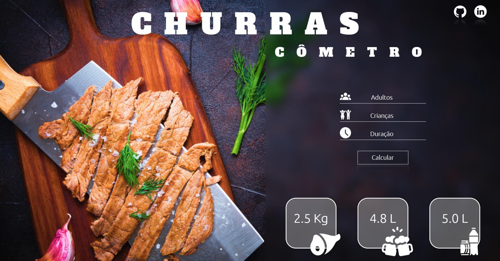
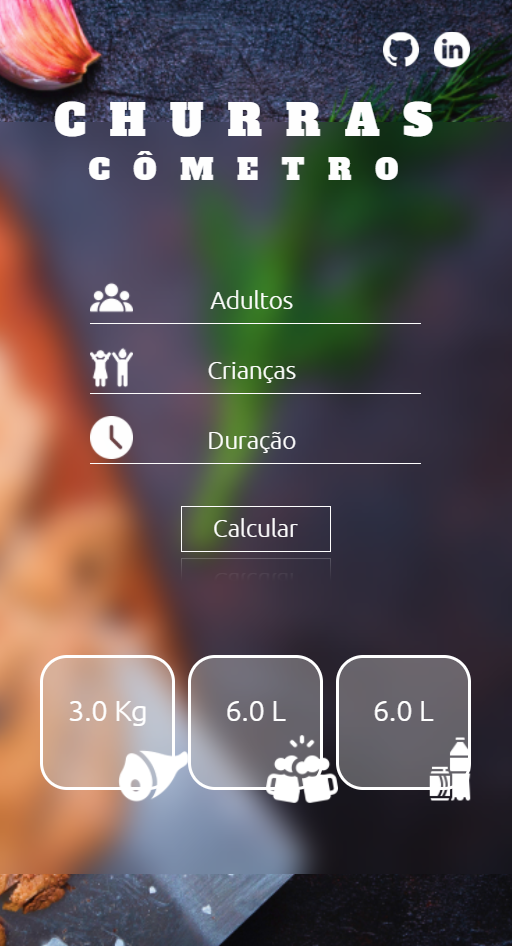

# 
 BBQ Party Calculator 

  

## About:
This application is able to calculate an amount of meats, drinks and beers for a party.
In this project the goal is to practice programming logic in Javascript.

In accordance with some informations, a party lasting 4 hours:

- 500 kg of meat;
- 1500 ml of beer;
- 1000 ml of soft-drink;

More than 4 hours hours:

- 650 kg of meat;
- 2000 ml of beer;
- 1500 ml of soft-drink;

For kids it is considered a half of everything. And beers is not allowed .

# Responsive Layout:

  

## Main Challenges:

- To build a right logic to calculate;
- Clean code method;
- Understand more about a reponsive web page;
- To build keyframes;

## Skills:

